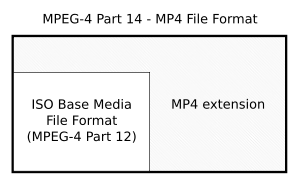
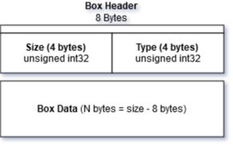

# Introduction
A technical introduction to the ISO Base Media File Format (ISOBMFF, MPEG-4 Part 12), also known as
just the MP4 container format. This guide will go over the components and byte structure of the MP4 container format with code examples to parse the data.

Feel free to send suggestions and corrections.


# Table of Contents
- [Introduction](#introduction)
- [Table of Contents](#table-of-contents)
- [The MP4 Container Format](#the-mp4-container-format)
- [Movie Atoms](#movie-atoms)
  - [Atom Header Format](#atom-header-format)
  - [Reading the Atom Data](#reading-the-atom-data)
  - [Basic Types](#basic-types)
- [Metadata](#metadata)
- [Fragmented MP4 (fMP4)](#fragmented-mp4-fmp4)
- [Movie Data & Codecs](#movie-data--codecs)
- [References and Resources](#references-and-resources)
- [License](#license)


# The MP4 Container Format
The MPEG-4 Part 14 (MP4) is one of the most common container formats for video and has an extension of `.mp4`. MP4 is an extension of the ISO Base Media File Format (ISOBMFF, MPEG-4 Part 12), which is a format designed to contain timed media information.

The ISOBMFF format is directly based on the [QuickTime](https://en.wikipedia.org/wiki/QuickTime_File_Format), therefore the MP4 is essentially identical to the QuickTime file format.




# Movie Atoms

## Atom Header Format



```
aligned(8) class Box (unsigned int(32) boxtype,
    optional unsigned int(8)[16] extended_type) {
    unsigned int(32) size;
    unsigned int(32) type = boxtype;
}
```

## Reading the Atom Data

## Basic Types

# Metadata

# Fragmented MP4 (fMP4)

# Movie Data & Codecs

# References and Resources
* https://developer.apple.com/library/archive/documentation/QuickTime/QTFF
* https://en.wikipedia.org/wiki/ISO/IEC_base_media_file_format

# License