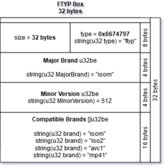
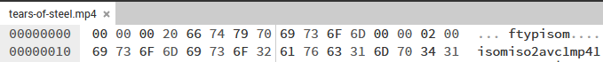

# Introduction
A technical introduction to the ISO Base Media File Format (ISOBMFF, MPEG-4 Part 12), also known as
just the MP4 container format. This guide will go over the components and byte structure of the MP4 container format with code examples to parse the data.

Feel free to send suggestions and corrections.

⚠️ *Currently a work-in-progress document. Check back for updates!*

# Table of Contents
- [Introduction](#introduction)
- [Table of Contents](#table-of-contents)
- [The MP4 Container Format](#the-mp4-container-format)
- [Movie Atoms](#movie-atoms)
  - [Atom Header Format](#atom-header-format)
  - [Reading the Atom Data](#reading-the-atom-data)
  - [Examples](#examples)
- [Fragmented MP4 (fMP4)](#fragmented-mp4-fmp4)
- [Movie Data & Codecs](#movie-data--codecs)
- [References and Resources](#references-and-resources)
- [Tools](#tools)


# The MP4 Container Format
The MPEG-4 Part 14 (MP4) is one of the most common container formats for video and has an extension of `.mp4`. MP4 is an extension of the ISO Base Media File Format (ISOBMFF, MPEG-4 Part 12), which is a format designed to contain timed media information.

The ISOBMFF format is directly based on the [QuickTime](https://en.wikipedia.org/wiki/QuickTime_File_Format), therefore the MP4 is essentially identical to the QuickTime file format.


# Movie Atoms

## Atom Header Format
The MP4 byte structure is composed of a series of boxes, also known as "atoms". Each box describes and contains data to build the MP4 container format.

The first 8 bytes of each box is known as the "Box Header", where the first 4 bytes are the size of the box, and the next 4 bytes are the box name. These are the two values you need to know to iterate and parse each box, byte by byte.

For example, this is an example of a Box Header:

```go
type Box struct {
  Size    int32
  Name    string
}
```


The box `Name` being the box type, also known as the `FourCC` code.

The box `Size` being the size (in bytes) of the box, including the box header.


## Reading the Atom Data
Reading the box data from each atom requires the box size, name and byte structure of each box you are parsing. You can refer to the MPEG-4 Part 14 specification for the byte structure of each known box, or just refer to some existing MP4 parsing open-source code.

For example, reading the Filetype Box (`ftyp`):

```go
type FtypBox struct {
  *Box
  MajorBrand       string   // Brand identifer.
  MinorVersion     uint32   // Informative integer for the minor version of the major brand.
  CompatibleBrands []string // A list, to the end of the box, of brands.
}
```


If you were to open this into a hex editor, it should look something like:


* Reading the first 4 bytes of the box header as an unsigned 32 bit integer (big endian) gives us the box size: `32 bytes`.
* The next 4 bytes gives us: `0x66747970` in hexidecimal, or `ftyp` as a string.
* Next 4 bytes gives us the Major Brand: `0x69736F6D` in hexidecimal, or `isom` as a string.
* Next 4 bytes gives us the Minor Version: `512`
* The next 16 bytes, read as `uint32be` (into a string) at a time gives us an array of compatible brands: `isom`, `iso2`, `avc1`, and `mp41`.
* We have read a total of `32 bytes` as defined in the box header. We can now read the next box header!

## Examples
Check out the following projects for more examples on parsing more boxes:
* https://github.com/alfg/mp4 - MP4 reader in Go.
* https://github.com/alfg/mp4rs - MP4 reader in Rust.

*Web Assembly examples coming soon!*

# Fragmented MP4 (fMP4)
TBD

# Movie Data & Codecs
TBD

# References and Resources
* https://developer.apple.com/library/archive/documentation/QuickTime/QTFF
* https://en.wikipedia.org/wiki/ISO/IEC_base_media_file_format
* https://github.com/alfg/mp4
* https://github.com/alfg/mp4rs

# Tools
* https://hexed.it
* https://www.diagrams.net/